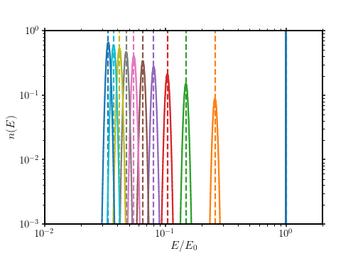
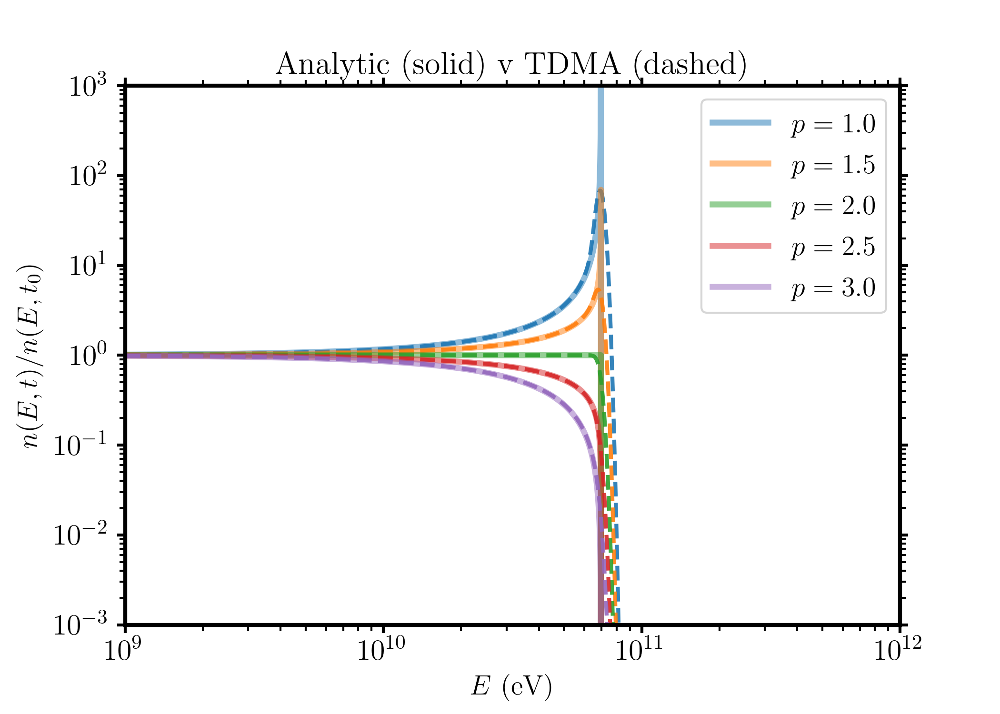

Tests
-------------------------------------------------

Test 1 : Cooled delta-function spectrum
==================================================
Our first test is simple advection of energy. We inject a delta function -- a population of electrons with a single energy or Lorentz factor. We define the cooling rate of electrons with energy :math:`E=\gamma mc^2` as

:math:`\frac{dE}{dt} = -C_E E^{2}` 

The energy of an electron with initial energy :math:`E_0` after cooling for a time :math:`t` is then given by 

:math:`E(t) = \frac{E_0^2}{E_0 - C_E E_0^2 t}` 

The test below compares the theoretically expected value with that obtained using msynchro's TDM algorithm. Some spreading in energy occurs due to numerical diffusion, but the peak of the distribution always matches theory. 

The plot shows the electron energy at 1 Myr intervals for a magnetic field strength of 6 microGauss. There are 1250 bins per energy decade in this case 

Test 2: Cooled electron power-law spectrum
==================================================
The theoretical Jaffe-Perola spectrum is given by, for an initial spectrum :math:`n(E,t_0) = n_0 E^{-p}`,

:math:`n(E,t)=\left\{\begin{array}{@{}% no padding@{}% no padding}n_0 E^{-p} (1 - C_E E t)^{p-2}, &  E \leq 1/(C_E t) \\ 0. & E > 1/(C_E t) & \end{array}\right.`

Thus, the ratio of the electron spectrum to the origin spectrum is, at :math:`E\leq 1/(C_E t)` given by 

:math:`\frac{n(E,t)}{n(E,t_0)} = (1 - C_E E t)^{p-2}`

The next plot compares the ratio from the numerical TDM calculation to the analytically expected one, for a time of 5 Myr and a magnetic field strength of 6 microGauss. The spectrum is initialised with a power-law with :math:`p=2.1` and Lorentz factors ranging from 10 to 10^9, with 10,000 energy bins.

Test 3: Synchrotron Spectrum
==================================================
